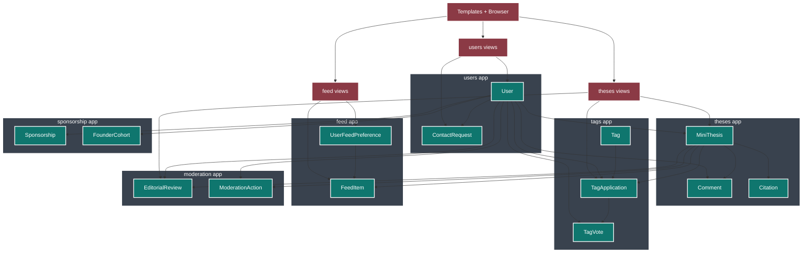

# Hume Social Platform Architecture

```mermaid
flowchart TB
    subgraph UMG[users app]
        U[User]
        CR[ContactRequest]
    end

    subgraph THM[theses app]
        MT[MiniThesis]
        CM[Comment]
        CT[Citation]
    end

    subgraph TGM[tags app]
        TG[Tag]
        TA[TagApplication]
        TV[TagVote]
    end

    subgraph FDM[feed app]
        FP[UserFeedPreference]
        FI[FeedItem]
    end

    subgraph MDM[moderation app]
        ER[EditorialReview]
        MA[ModerationAction]
    end

    subgraph SPM[sponsorship app]
        SP[Sponsorship]
        FC[FounderCohort]
    end

    UI[Templates + Browser]
    VU[users views]
    VT[theses views]
    VF[feed views]

    UI --> VU
    UI --> VT
    UI --> VF

    VU --> U
    VU --> CR
    VT --> MT
    VT --> ER
    VT --> TA
    VF --> FP
    VF --> FI

    U --> MT
    U --> CM
    U --> TA
    U --> TV
    U --> ER
    U --> MA
    U --> SP
    U --> FC
    U --> CR

    MT --> CM
    MT --> CT
    MT --> TA
    MT --> ER
    MT --> MA
    MT --> FI

    TG --> TA
    TA --> TV
    FP --> FI

    classDef model fill:#0f766e,stroke:#ffffff,stroke-width:2px,color:#ffffff
    classDef flow fill:#8b3a45,stroke:#ffffff,stroke-width:2px,color:#ffffff
    classDef app fill:#39424e,stroke:#ffffff,stroke-width:2px,color:#ffffff

    class U,CR,MT,CM,CT,TG,TA,TV,FP,FI,ER,MA,SP,FC model
    class VU,VT,VF,UI flow
    class UMG,THM,TGM,FDM,MDM,SPM app
```