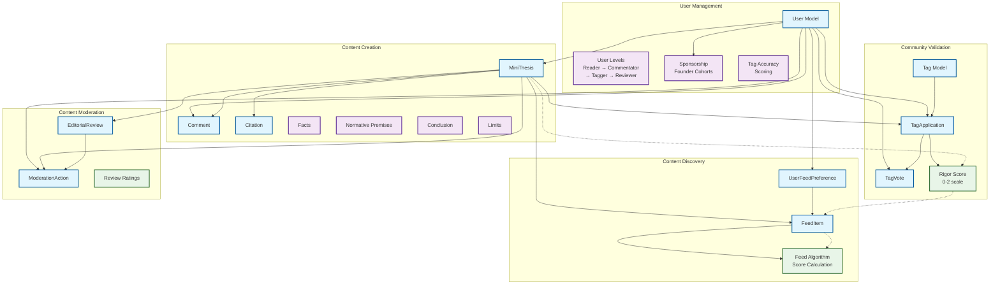

# Hume Social Platform Architecture

```mermaid
graph TB
    %% User System
    subgraph "User Management"
        U[User Model]
        UL[User Levels<br/>Reader → Commentator<br/>→ Tagger → Reviewer]
        SP[Sponsorship<br/>Founder Cohorts]
        TA[Tag Accuracy<br/>Scoring]
    end

    %% Content System
    subgraph "Content Creation"
        MT[MiniThesis]
        C[Comment]
        CT[Citation]
        F[Facts]
        P[Normative Premises]
        CN[Conclusion]
        L[Limits]
    end

    %% Validation System
    subgraph "Community Validation"
        TAG[Tag Model]
        TA_APP[TagApplication]
        TV[TagVote]
        RS[Rigor Score<br/>0-2 scale]
    end

    %% Feed System
    subgraph "Content Discovery"
        FP[UserFeedPreference]
        FI[FeedItem]
        FA[Feed Algorithm<br/>Score Calculation]
    end

    %% Moderation System
    subgraph "Content Moderation"
        MR[EditorialReview]
        MA[ModerationAction]
        MQ[Review Ratings]
    end

    %% Relationships
    U --> MT
    U --> C
    U --> TA_APP
    U --> TV
    U --> FP
    U --> SP
    U --> MA

    MT --> C
    MT --> CT
    MT --> TA_APP
    MT --> FI
    MT --> MR
    MT --> MA

    TAG --> TA_APP
    TA_APP --> TV
    TA_APP --> RS

    FP --> FI
    FI --> FA

    MR --> MA

    %% Data Flow
    MT -.-> RS
    RS -.-> FI
    FI -.-> FA

    %% Styling
    classDef modelClass fill:#e1f5fe,stroke:#01579b,stroke-width:2px
    classDef systemClass fill:#f3e5f5,stroke:#4a148c,stroke-width:2px
    classDef processClass fill:#e8f5e8,stroke:#1b5e20,stroke-width:2px

    class U,MT,C,CT,TAG,TA_APP,TV,FP,FI,MR,MA modelClass
    class UL,SP,TA,F,P,CN,L systemClass
    class RS,FA,MQ processClass
```