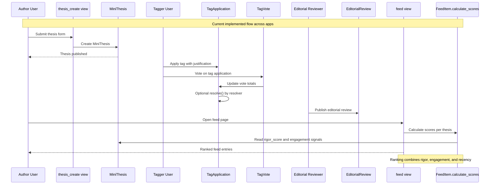

# Content Creation and Validation Sequence

```mermaid
sequenceDiagram
    participant Author as Author User
    participant ThesisView as thesis_create view
    participant MT as MiniThesis
    participant Tagger as Tagger User
    participant TA as TagApplication
    participant TV as TagVote
    participant Rev as Editorial Reviewer
    participant ER as EditorialReview
    participant FeedView as feed view
    participant FI as FeedItem.calculate_scores

    Note over Author,FI: Current implemented flow across apps

    Author->>ThesisView: Submit thesis form
    ThesisView->>MT: Create MiniThesis
    MT-->>Author: Thesis published

    Tagger->>TA: Apply tag with justification
    Tagger->>TV: Vote on tag application
    TV->>TA: Update vote totals
    TA->>TA: Optional resolve() by resolver

    Rev->>ER: Publish editorial review

    Author->>FeedView: Open feed page
    FeedView->>FI: Calculate scores per thesis
    FI->>MT: Read rigor_score and engagement signals
    FeedView-->>Author: Ranked feed entries

    Note over FeedView,FI: Ranking combines rigor, engagement, and recency
```