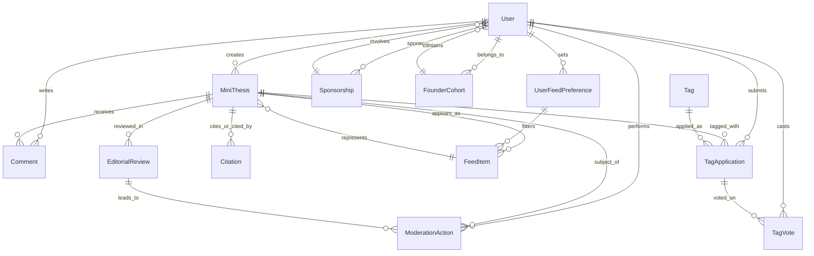

# Database Relationships (Entity-Relationship Diagram)

```mermaid
erDiagram
    User ||--o{ MiniThesis : creates
    User ||--o{ Comment : writes
    User ||--o{ TagApplication : submits
    User ||--o{ TagVote : casts
    User ||--o{ UserFeedPreference : sets
    User ||--o{ Sponsorship : sponsors
    User ||--o{ FounderCohort : belongs_to
    User ||--o{ ModerationAction : performs

    MiniThesis ||--o{ Comment : receives
    MiniThesis ||--o{ Citation : cites_or_cited_by
    MiniThesis ||--o{ TagApplication : tagged_with
    MiniThesis ||--o{ FeedItem : appears_as
    MiniThesis ||--o{ EditorialReview : reviewed_in
    MiniThesis ||--o{ ModerationAction : subject_of

    Tag ||--o{ TagApplication : applied_as
    TagApplication ||--o{ TagVote : voted_on

    UserFeedPreference ||--o{ FeedItem : filters
    FeedItem ||--o{ MiniThesis : represents

    Sponsorship ||--o{ User : involves
    FounderCohort ||--o{ User : contains

    EditorialReview ||--o{ ModerationAction : leads_to
```