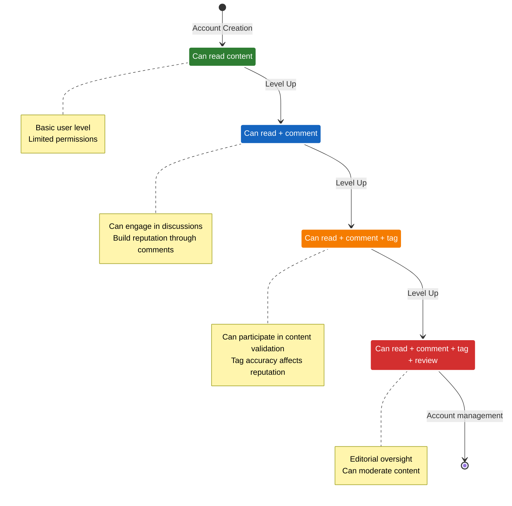

# User Progression and Permission System

```mermaid
stateDiagram-v2
    [*] --> Reader: Account Creation

    Reader --> Commentator: Level Up
    Commentator --> Tagger: Level Up
    Tagger --> Reviewer: Level Up

    Reader: Can read content
    Commentator: Can read + comment
    Tagger: Can read + comment + tag
    Reviewer: Can read + comment + tag + review

    note right of Reader
        Basic user level
        Limited permissions
    end note

    note right of Commentator
        Can engage in discussions
        Build reputation through comments
    end note

    note right of Tagger
        Can participate in content validation
        Tag accuracy affects reputation
    end note

    note right of Reviewer
        Editorial oversight
        Can moderate content
    end note

    Reviewer --> [*]: Account management

    %% Styling - High Contrast Theme
    classDef readerClass fill:#2e7d32,stroke:#ffffff,stroke-width:3px,color:#ffffff
    classDef commentatorClass fill:#1565c0,stroke:#ffffff,stroke-width:3px,color:#ffffff
    classDef taggerClass fill:#f57c00,stroke:#ffffff,stroke-width:3px,color:#ffffff
    classDef reviewerClass fill:#d32f2f,stroke:#ffffff,stroke-width:3px,color:#ffffff

    class Reader readerClass
    class Commentator commentatorClass
    class Tagger taggerClass
    class Reviewer reviewerClass
```