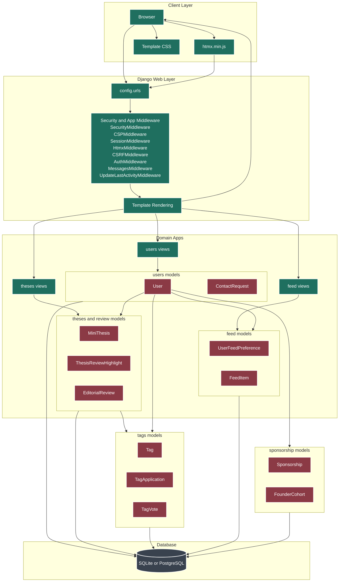

# Hume Social Platform Architecture

```mermaid
flowchart TB
    subgraph CLIENT[Client Layer]
        B[Browser]
        HTMX[htmx.min.js]
        CSS[Template CSS]
        B --> HTMX
        B --> CSS
    end

    subgraph WEB[Django Web Layer]
        URL[config.urls]
        MW[Security and App Middleware\nSecurityMiddleware\nCSPMiddleware\nSessionMiddleware\nHtmxMiddleware\nCSRFMiddleware\nAuthMiddleware\nMessagesMiddleware\nUpdateLastActivityMiddleware]
        TV[Template Rendering]
        URL --> MW
        MW --> TV
    end

    subgraph APPS[Domain Apps]
        UV[users views]
        THV[theses views]
        FV[feed views]
        UV --> UM
        THV --> TM
        FV --> FM
    end

    subgraph UM[users models]
        U[User]
        CR[ContactRequest]
    end

    subgraph TM[theses and review models]
        MT[MiniThesis]
        THR[ThesisReviewHighlight]
        ER[EditorialReview]
    end

    subgraph TAGM[tags models]
        TG[Tag]
        TA[TagApplication]
        TVOTE[TagVote]
    end

    subgraph FM[feed models]
        FP[UserFeedPreference]
        FI[FeedItem]
    end

    subgraph SPM[sponsorship models]
        SP[Sponsorship]
        FC[FounderCohort]
    end

    subgraph DB[Database]
        SQLITE[(SQLite or PostgreSQL)]
    end

    B --> URL
    HTMX --> URL
    TV --> B

    TV --> UV
    TV --> THV
    TV --> FV

    TM --> TAGM
    U --> TM
    U --> TAGM
    U --> FM
    U --> SPM

    UM --> SQLITE
    TM --> SQLITE
    TAGM --> SQLITE
    FM --> SQLITE
    SPM --> SQLITE

    classDef layer fill:#1f6f5f,stroke:#ffffff,stroke-width:2px,color:#ffffff
    classDef model fill:#8b3a45,stroke:#ffffff,stroke-width:2px,color:#ffffff
    classDef storage fill:#39424e,stroke:#ffffff,stroke-width:2px,color:#ffffff

    class B,HTMX,CSS,URL,MW,TV,UV,THV,FV layer
    class U,CR,MT,THR,ER,TG,TA,TVOTE,FP,FI,SP,FC model
    class SQLITE storage
```