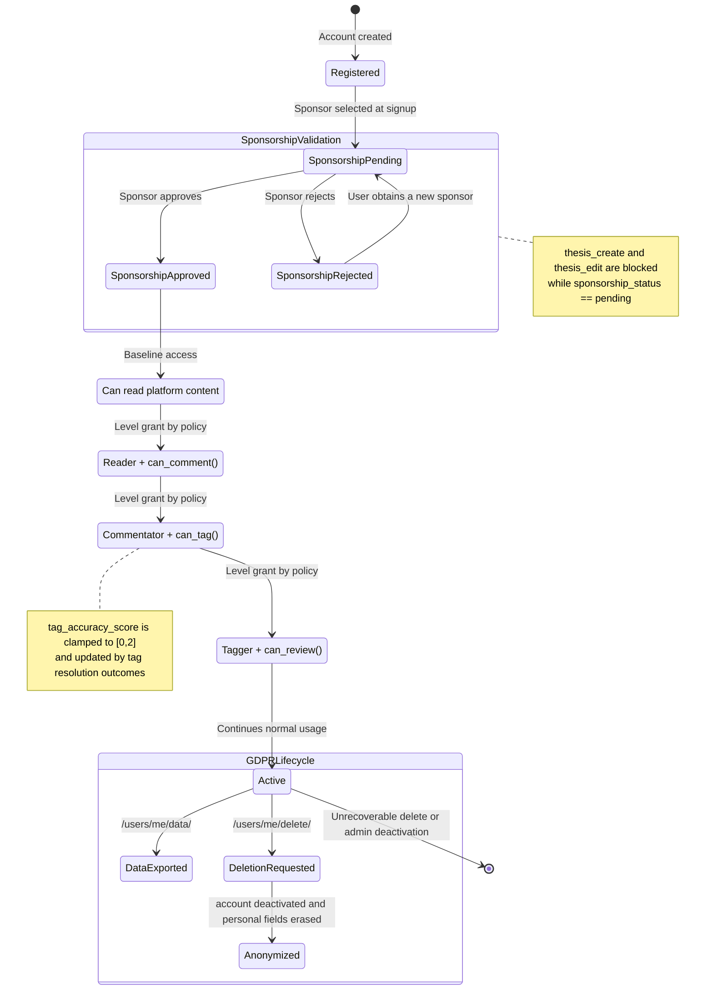

# User Progression and Permission System

```mermaid
stateDiagram-v2
    [*] --> Registered: Account created
    Registered --> SponsorshipPending: Sponsor selected at signup

    state SponsorshipValidation {
        SponsorshipPending --> SponsorshipApproved: Sponsor approves
        SponsorshipPending --> SponsorshipRejected: Sponsor rejects
        SponsorshipRejected --> SponsorshipPending: User obtains a new sponsor
    }

    SponsorshipApproved --> Reader: Baseline access

    Reader --> Commentator: Level grant by policy
    Commentator --> Tagger: Level grant by policy
    Tagger --> EditorialReviewer: Level grant by policy

    Reader: Can read platform content
    Commentator: Reader + can_comment()
    Tagger: Commentator + can_tag()
    EditorialReviewer: Tagger + can_review()

    note right of SponsorshipValidation
        thesis_create and thesis_edit are blocked
        while sponsorship_status == pending
    end note

    note right of Tagger
        tag_accuracy_score is clamped to [0,2]
        and updated by tag resolution outcomes
    end note

    state GDPRLifecycle {
        Active --> DataExported: /users/me/data/
        Active --> DeletionRequested: /users/me/delete/
        DeletionRequested --> Anonymized: account deactivated and personal fields erased
    }

    EditorialReviewer --> Active: Continues normal usage
    Active --> [*]: Unrecoverable delete or admin deactivation
```